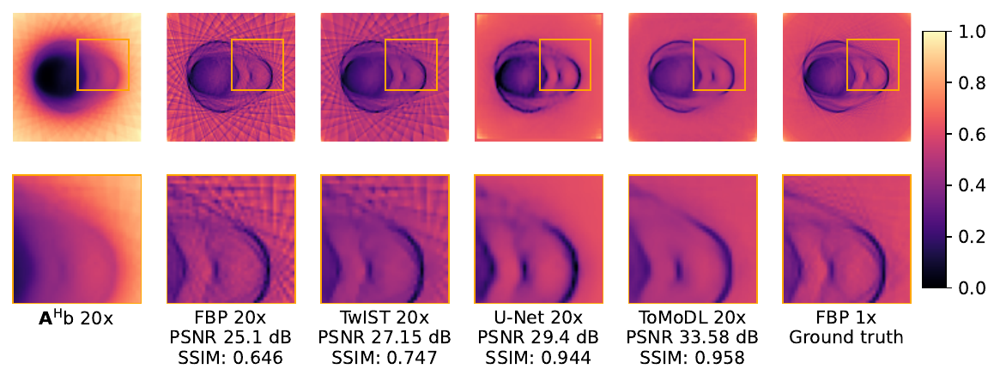

<h1 align="center">🔬<ins>ToMoDL</ins>🔬<br>Model-Based Deep Learning Architecture for Optical Tomography Projection 3D Reconstruction</h1>
<p align="center">
  <a href="https://www.linkedin.com/in/marcos-obando-22a816170">Marcos Obando</a>
  ·
  <a href="https://www.creatis.insa-lyon.fr/~ducros/WebPage/">Nicolas Ducros</a>
  ·
  <a href="https://scholar.google.com/citations?user=8ZHx3j8AAAAJ&hl=fr">Andrea Bassi</a>
  ·
  <a href="https://scholar.google.com/citations?hl=es&user=LUH06dgAAAAJ&view_op=list_works&sortby=pubdate">Germán Mato</a>
  ·
  <a href="https://scholar.google.com/citations?user=-xtye-QAAAAJ&hl=en">Teresa Correia</a>
</p>
<p align="center">
</img>
<br>
<em>ToMoDL is a model-based neural network for tomographic reconstruction with a low number of samples<br>Introducing a physics informed reconstruction algorithm, high quality images can be recovered from more than 20 times less acquisition data.</em>
</p>

##

Welcome to the ToMoDL GitHub repository! This repository contains code that implements a technique for reconstructing OPT (Optical Projection Tomography) images by solving an optimization problem using a Model-Based Deep Learning (MoDL) architecture. 🌟

### 📝 Description

This code is based on the MoDL architecture developed in [1]. It provides a powerful method to reconstruct OPT images by solving the following optimization problem:

$$ \mathbf{x_{rec}} = \arg\min_{\mathbf{x}} ||\mathbf{A}\mathbf{x} - \mathbf{b}||^2_2 + \lambda ||\mathbf{x}-\mathcal{D}_{\mathbf{\theta}}(\mathbf{x})||^2_2 $$

Here, $\mathbf{A}$ can be any measurement operator, and in our case, we considered the Radon transform operator combined with an undersampling mask. $\mathcal{D}_{\mathbf{\theta}}(\mathbf{x})$ represents the denoiser, which uses a residual learning CNN.


### 📦 Dependencies

The code relies on the Torch Radon library, developed by Ronchetti [2], for implementing the Radon forward and backward operators. To install it, you can use the following command:

```shell script
wget -qO- https://raw.githubusercontent.com/matteo-ronchetti/torch-radon/master/auto_install.py  | python -
```

Please note that Torch Radon has some compatibility issues with PyTorch versions above 1.7. We recommend creating a virtual environment with PyTorch version between 1.5 and 1.7. Python 3.8 should work fine.

Additionally, the training code requires the `tqdm` library to track the training progress.

### 📚 OPT Datasets

The ToMoDL architecture can be trained using the OPT datasets stored in the `DataOPT` folder. These datasets consist of transmitted projection images of live zebrafish at different days post fertilization (dpf). Each dataset comprises a series of 888 sinograms `y` of shape `D x θ`, sampled at 720 angle steps (0.5 degrees per step) with an 880-pixel detector, where each pixel is evenly spaced by 1.3 μm.

To ensure compatibility with Torch Radon operators, sinograms are resized to 640 angle steps, making them a multiple of 16 projections. The image preprocessing involves registering opposite pairs to correct the axis of rotation's shift with respect to the detector.


## 📂 File Descriptions


## 📚 References

[1] MoDL: Model-Based Deep Learning Architecture for Inverse Problems by H.K. Aggarwal, M.P Mani, and Mathews Jacob in IEEE Transactions on Medical Imaging, 2018.

[2] Ronchetti, M. (2020). Torchradon: Fast differentiable routines for computed tomography. arXiv preprint arXiv:2009.14788.

Explore the code and have fun reconstructing optical tomography projections with ToMoDL! If you have any questions or suggestions, feel free to reach out. 🤗🚀
